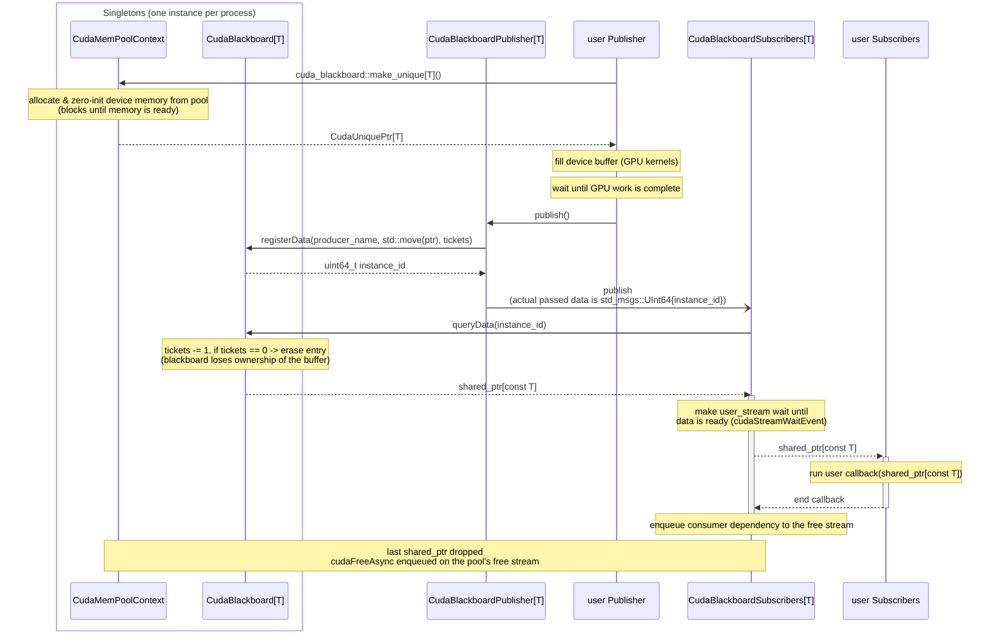

# cuda_blackboard

The `cuda_blackboard` is a minimalistic implementation of the hardware acceleration in ROS enabled by [REP2007: type adaptation](https://ros.org/reps/rep-2007.html) and [REP2009: type negotiation](https://ros.org/reps/rep-2009.html).
Although it does not require the use of additional libraries, it requires the use of NVIDIA GPUs and CUDA.

## Introduction

ROS does not include the use of hardware acceleration in its original design, and nodes that implement some sort of hardware acceleration (e.g., ML models, image compression, etc) require at each step to copy the data from host to device and vice versa, limiting the benefits resulting from the acceleration.

By leveraging type adaptation and negotiation, we implement a mechanism that enables data sharing between different nodes without it ever leaving the GPU. Additionally, it is compatible with traditional ROS publisher/subscribers as shown in the following table:

| Publisher / Subscriber | ROS                 | cuda_blackboard     |
| ---------------------- | ------------------- | ------------------- |
| ROS                    | no copy             | host to device copy |
| cuda_blackboard        | device to host copy | no copy             |

## Mechanism

The `CudaBlackboard` is a structure following a singleton pattern (one instance per process), in which data (containing structures in the GPU) are stored in dictionaries.

- The dictionary data can be accessed through an UID, which is generated automatically when inserting new data to the blackboard. Additionally, the data can be accessed through a signature from the entity inserting data to the blackboard.
- The structure inside the dictionary consists of the actual data to be inserted, the UID, the writer's signature, and a number of tickets. The number of tickets is set by the entity inserting the data.
- Through the use of the UID or the writer's signature, other entities can have access to the blackboard data. Each time an entity retrieves an element, its number of tickets decreases by one. Once it reaches zero, the data is removed from the blackboard.
- To avoid unbounded memory allocation or leaks, when an entity tries to insert data with a signature for which there is already data present, it will first delete it and then add the new data with a new UID. This is needed for cases where the entities who would want to access the data are slower than the ones inserting it.

### Data flow

The diagram below summarizes how device memory flows through `cuda_blackboard`. Both the `CudaBlackboard` and the `CudaMemPoolContext` are process-wide singletons. Publisher and subscriber nodes pull device buffers from the shared memory pool, "publishing" means registering the data pointer in the blackboard with a number of tickets, and the buffer is freed (returned to the pool) only once nobody references it anymore.



### Memory management

Device memory for `cuda_blackboard` types is allocated and freed through `cuda_blackboard::make_unique`, which returns a `CudaUniquePtr` (a `std::unique_ptr` with a custom deleter). All of these allocations are served from a single, process-wide CUDA memory pool owned by the `CudaMemPoolContext` singleton. The context owns **two dedicated non-blocking CUDA streams** used exclusively for the pool's asynchronous operations: an **allocation stream** (`stream()`) and a **free stream** (`free_stream()`). They are kept separate so that the consumer-completion waits enqueued before a free can never stall the host-side allocation sync.

- **Allocation** (`make_unique`) calls `cudaMallocFromPoolAsync` on the allocation stream and then synchronizes before returning. Hence the returned buffer is guaranteed to be ready to use from any stream.
- **Deallocation** happens in the `CudaUniquePtr` destructor (`CudaDeleter`), which calls `cudaFreeAsync` on the **free stream**. This is non-blocking: the free is enqueued but **not** synchronized on the host.

Because the free is asynchronous, it must be ordered _after_ every consumer that touched the buffer; otherwise the pool could hand the region to a new allocation while a kernel is still reading from or writing to it.

> [!IMPORTANT]
> **The simplest way to guarantee correctness is to synchronize your consuming stream inside the callback** (e.g. `cudaStreamSynchronize`) before it returns. Once the callback returns, all GPU work touching the buffer has completed, so the eventual `cudaFreeAsync` is always safe — independent of which stream you used or how it was created. This is the recommended baseline.

As a higher-throughput alternative that avoids a host-side sync, `cuda_blackboard` can order the free behind your consumption **at the stream level** instead:

- `CudaBlackboardSubscriber` accepts the consumer's CUDA stream as a `user_stream` constructor argument. Before invoking the callback it makes `user_stream` wait on the buffer's `ready_event`; after the callback returns it records an event on `user_stream` and makes the pool's free stream wait on it. Since `CudaDeleter` frees on that same free stream, the `cudaFreeAsync` is guaranteed to run only once the consumer's stream work has completed — without blocking the host.
- The `CudaImage` / `CudaPointCloud2` destructors apply the same free-stream ordering to their internal `ready_event`.

> [!WARNING]
> The `user_stream` mechanism is only correct if the stream actually doing the consumption is the one the dependency is recorded on. If you omit `user_stream` (or pass the legacy default stream — `cudaStreamLegacy` / `0` / `nullptr`), the subscriber falls back to recording the consumer-completion event on the **legacy default stream** and logs a warning.
>
> **This fallback silently fails** when _all_ of the following hold:
>
> - the buffer is consumed on a stream created with the `cudaStreamNonBlocking` flag (which, by design, does **not** synchronize with the legacy default stream), **and**
> - that stream is not passed as `user_stream`, **and**
> - the callback does not synchronize that stream before returning.
>
> In that case the event recorded on the legacy default stream never observes the consumer's work, so the free stream does not wait for it. The buffer may then be freed and reused **while your kernels are still using it**, causing data corruption that is timing-dependent and may surface only sporadically. If you do not synchronize in the callback, you **must** pass the exact consuming stream as `user_stream`.

The pool is configured with a high release threshold (`cudaMemPoolAttrReleaseThreshold`, 1 GiB by default) so that freed memory is retained and reused rather than returned to the driver, avoiding repeated expensive allocations. The threshold can be overridden via the `CUDA_BLACKBOARD_MEM_POOL_RELEASE_THRESHOLD_MB` environment variable (value in MiB).

Type adaptation and negotiation turn the `CudaBlackboard` into an effective hardware acceleration / cuda layer for ROS.
Normal structures containing device (GPU) memory can be inserted into the blackboard using an API similar to normal ROS publishers (`CudaBlackboardPublisher`), while internally the data transmitted through ROS is the UID. In this case, the number of tickets is the number of subscribers to the ROS topic. On the subscriber side, the `CudaBlackboardSubscriber` receives the UID, retrieves the data in the blackboard, and executes a callback in the parent node without incurring into a copy.

To achieve compatibility, type adaptation and negotiation are also key. When a traditional subscriber connects to a `CudaBlackboardPublisher` or the other way around, the data will be converted to or from a traditional ROS message matching the structure.

## API

### Cuda blackboard types

In this package, we define `CudaImage` and `CudaPointCloud2` as new types for hardware acceleration. They subclass their `sensor_msgs::msg::Image` and `sensor_msgs::msg::PointCloud2`, but their data field is a pointer to device memory.
This makes possible to easily convert between traditional and accelerated types under the hood, with minimal changes needed in user code.

New types can be easily added by following this pattern.

### Publisher

`CudaBlackboardPublisher` can be created and used in a similarly to traditional ROS ones.

```c++
auto pub = std::make_shared<CudaBlackboardPublisher<CudaImage>>(*this, "image_raw");
```

The previous code will create both a `image_raw` (`sensor_msgs::msg::Image`) and a `image_raw/cuda` (`negotiated_interfaces/msg/NegotiatedTopicsInfo` used for type negotiation).
Traditional ROS nodes can directly subscribe to `image_raw` with no other changes.

Publishing also works on the same way:

```c++
auto cuda_image_ptr = std::make_unique<CudaImage>(ros_image);
pub_->publish(std::move(cuda_image_ptr));
```

where `ros_image` is a normal `sensor_msgs::msg::Image` and a constructor is implemented to copy the data to the GPU.

### Subscriber

`CudaBlackboardSubscriber` also works in a similar way to its traditional counterpart:

```c++
auto sub = std::make_shared<CudaBlackboardSubscriber<CudaImage>>(*this, "image_raw", false, callback);
```

where `callback` follows the signature of a traditional ROS one `std::shared_ptr<const CudaImage> cuda_msg`.
If the data is not already on device memory (i.e., comes from a traditional publisher), it will be copied under the hood.

## Example

To illustrate the use of the `cuda_blackboard` and its structures, we provide a simple example:
In a publisher node we load an image from disk, move it to the GPU, and publish it using a `CudaBlackboardPublisher` in the form of a `CudaImage`.
Then, in a subscriber node, utilizing a `CudaBlackboardSubscriber` we get the `CudaImage`, copy the data to host memory, and republish it again to a different topic.

The example can be run with the following command:

```bash
ros2 launch cuda_blackboard example.launch.py
```

In this case, the `/image_raw` is offered, but by default there is no subscriptions. The output image can be checked in the `/output_image` topic.

## Limitations

For the `cuda_blackboard` to work, all nodes must reside in the same process. In ROS, this is achieved through the use of `component_containers` and `ComposableNodes` (see the example).
However, due to how type negotiation works, the global option `use_intra_process_comms` can not be set to `true` in nodes that use the `cuda_blackboard`, and instead must be set for each traditional subscriber independently:

```c++
rclcpp::SubscriptionOptions sub_options;
sub_options.use_intra_process_comm = rclcpp::IntraProcessSetting::Enable;

pointcloud_sub_ = this->create_subscription<sensor_msgs::msg::PointCloud2>(
  "~/input/pointcloud", rclcpp::SensorDataQoS{}.keep_last(1),
  std::bind(&ExampleNode::callback, this, std::placeholders::_1),
  sub_options);
```

## Roadmap

- Zero copy: multiple `cuda_blackboard` publisher/subscribers using the same data will incur in several device to device copies. By adding an option to limit the number of `cuda_blackboard` tickets to 1, ownership of the data can be transferred to the subscriber.
